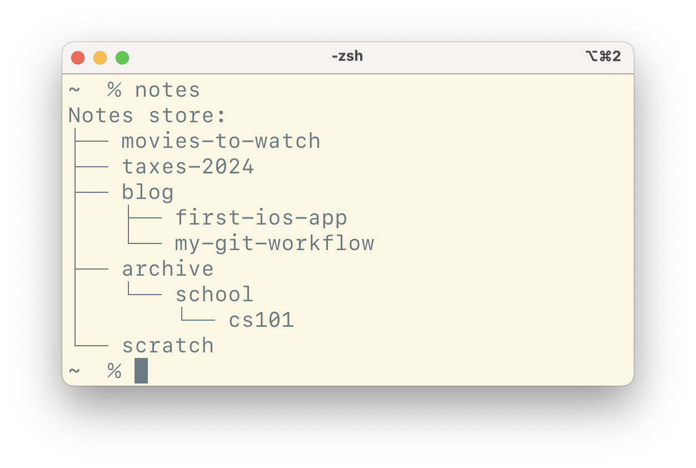

# Notes

Local notes, gpg-encrypted.

Simple CLI (similar to [pass](https://www.passwordstore.org)).
Single-file installation, < 400 lines of code.



Run `notes -h` for a full description of available commands.

## Dependencies

- gpg
- git (optional)
- sed
- tree
- find

## Storage

Notes are stored in `$NOTES_DIR`, which defaults to `$HOME/.note-store` if it is unset.

Each note is stored as a file, with filename formatted as `<name>.md.gpg`.
The contents of each note are never stored in plain text, only the filenames themselves.

## Editing

When running `note edit <note name>`, the associated note is decrypted using your default gpg key, then opened using your `$EDITOR`.

## Git

You can optionally initialize a git repo within the notes directory by running `notes git init`.
After that, every change to the store will be automatically tracked with a new commit to that repo.

You can also run any git other command from within that directory by simply prepending the `notes` command, like so:

```
notes git <normal git commands + args>
```

For example, creating an encrypted backup of your entire notes storage is as easy as pushing to a remote repository (since notes are only stored in their encrypted form).

```
notes git push <remote>
```

## Known security issues

When a note is opened for editing, it is first decrypted to plaintext using your GPG credentials.
When you exit the editor, this plaintext file is usually deleted.
However, there are situations when it will _not_ be deleted.

For example, if your computer crashes while you are editing a note, the plaintext version of the note will be left on your disk (this actually happened to me once).

In order to reduce the risk of leaving plaintext lying around, a few precautions are taken:

1. The `notes list` command (alias `notes`) will highlight any plaintext note files in RED.
2. Plaintext note files are automatically ignored in `.gitignore` with `**/*.md`, so they will not be tracked by git.
3. The command `notes clean` will automatically clean up any plaintext files.
4. Any variables exposing plaintext within the code are suffixed with `_PLAINTEXT` for clarity.
